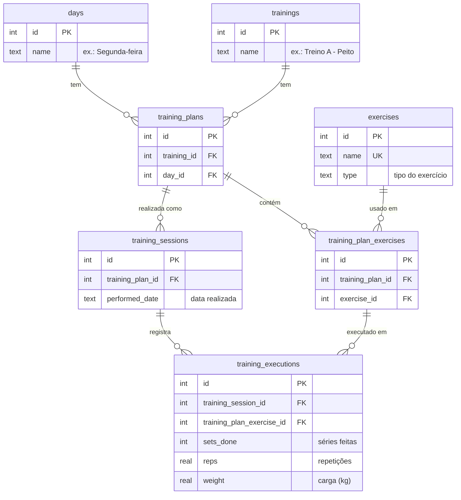
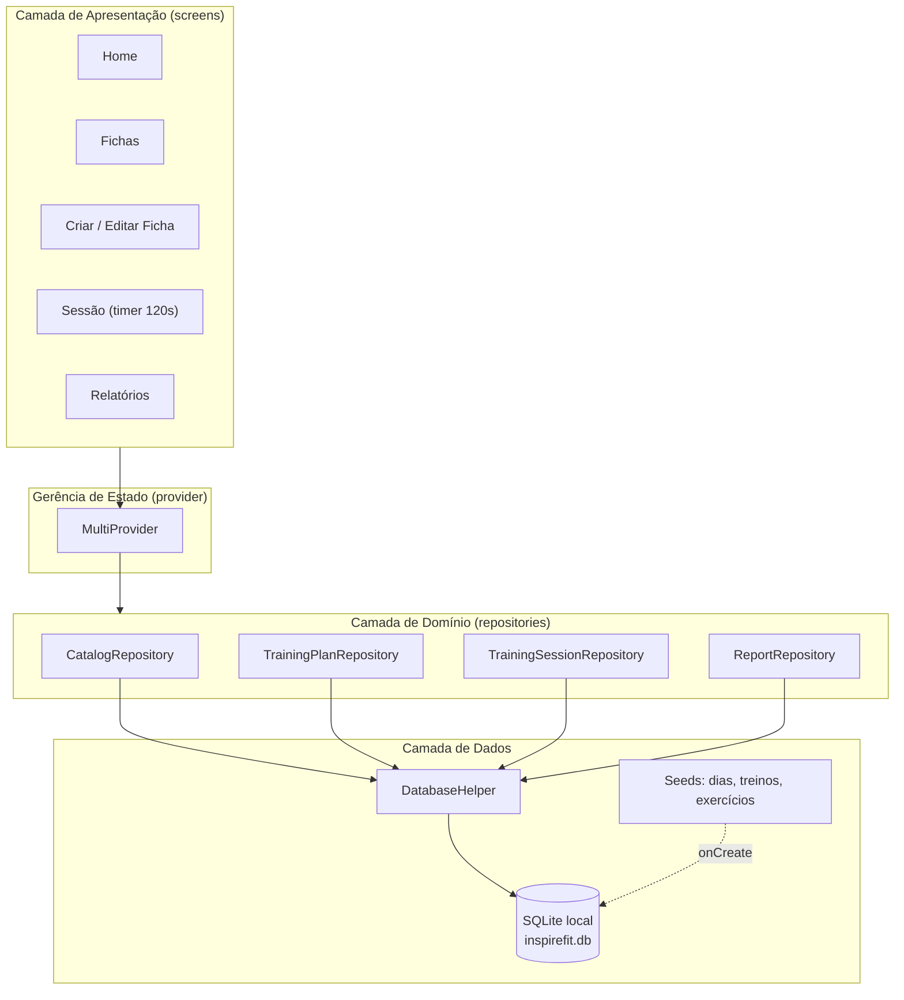
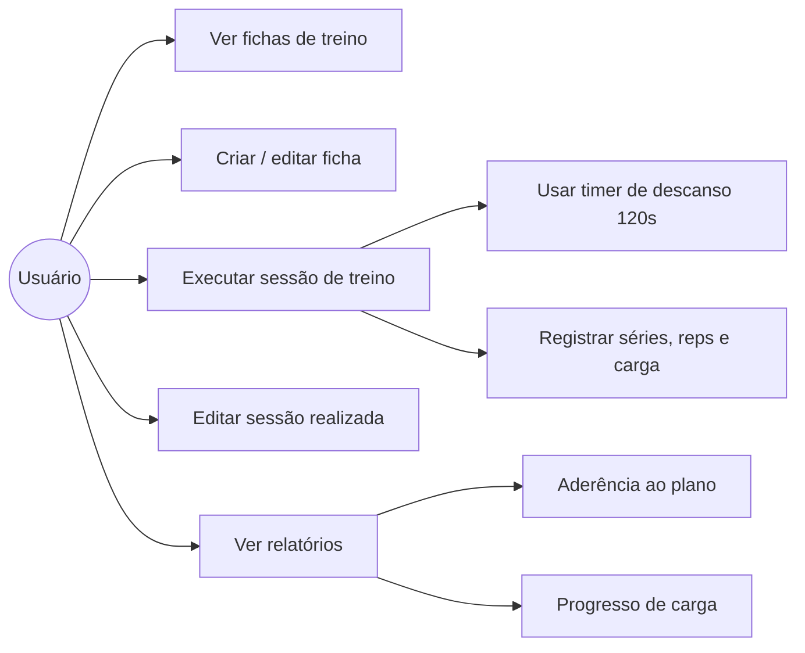
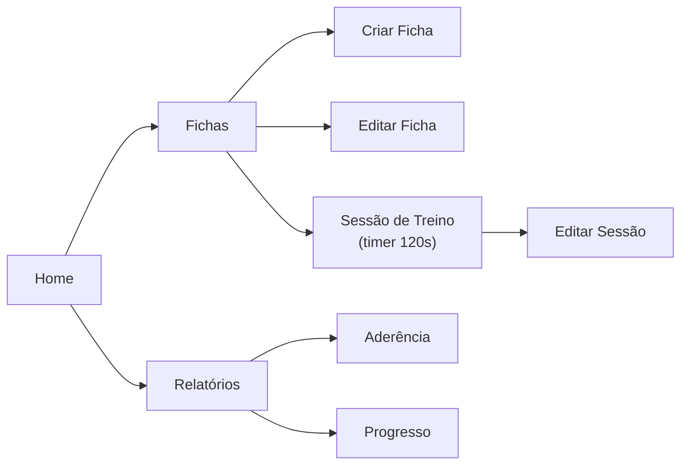

# InspireFit — Diagramas do Projeto de Extensão

App de academia em **Flutter**, **offline**, com banco **SQLite local** (sqflite),
sem backend e sem login (usuário único). Gerência de estado com **provider**.

> Os diagramas abaixo estão em [Mermaid](https://mermaid.live). Para gerar uma imagem,
> cole o código em <https://mermaid.live> e exporte como PNG/SVG.

---

## 1. Diagrama Entidade-Relacionamento (banco de dados)

**Leitura:** uma *ficha* (`training_plans`) liga um **treino** a um **dia** e reúne vários
**exercícios** (`training_plan_exercises`). Cada vez que o usuário treina, cria-se uma
**sessão** (`training_sessions`), e cada exercício feito vira uma **execução**
(`training_executions`) com séries, repetições e carga — base dos relatórios de progresso.

---

## 2. Arquitetura em camadas

---

## 3. Casos de uso (o que o usuário faz)

---

## 4. Fluxo de navegação de telas

